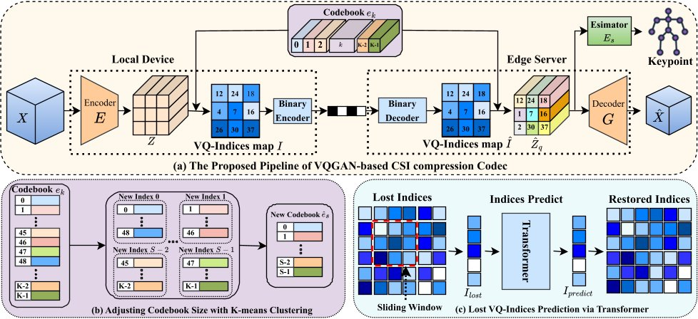

# TinySense: Effective CSI Compression for Scalable and Accurate Wi-Fi Sensing

TinySense is an efficient compression framework designed to solve the bottleneck of transmitting high-dimensional Channel State Information (CSI) in Wi-Fi sensing applications. By leveraging a **Vector Quantization-based Generative Adversarial Network (VQGAN)** and a **split-computing architecture**, TinySense achieves ultra-low bitrate compression while maintaining high accuracy for **Human Pose Estimation (HPE)**.

---

## 📄 Abstract
<p align="center">
  
</p>

With the growing demand for device-free and privacy-preserving sensing solutions, Wi-Fi sensing has emerged as a promising approach for human pose estimation. However, existing methods often process vast amounts of CSI data directly, straining networking resources.

TinySense addresses this challenge by partitioning the deep neural network between a local device (encoder) and a cloud server (decoder/estimator). It introduces:

- **VQGAN-based Compression**: Compressing CSI into discrete latent codes  
- **Adaptive Bitrate**: Using K-means clustering to dynamically adjust codebook sizes  
- **Error Recovery**: A Transformer model to predict missing indices in unreliable network conditions  

Experiments show that TinySense achieves up to **1.5× higher HPE accuracy ($PCK_{20}$)** than state-of-the-art methods under the same compression rate, with **5× lower latency**.

---

## 🏗️ System Architecture
<p align="center">
  
</p>

TinySense operates under a **Split Computing** framework.

### 1. Local Device (Edge)
- **Feature Extraction ($E$)**: A lightweight encoder extracts latent features $Z$ from raw CSI input $X$.
- **Quantization**: Latent features are mapped to a learned codebook $e_k$ to generate VQ indices $I$.
- **Compression**: The indices are binary-encoded for transmission, drastically reducing payload size.
### 2. Edge Server (Cloud)
- **Recovery (Transformer)**: A Transformer predicts missing indices caused by packet loss during transmission.
- **Reconstruction ($G$)**: The decoder reconstructs CSI data $\hat{X}$ from the quantized indices.
- **Estimation ($E_s$)**: A downstream estimator predicts human pose keypoints from reconstructed CSI.

---

## Real-world Prototype

To evaluate the resource consumption, we implement a real-world prototype with some Raspberry Pi/Jetson Nano serve as low-power devices, and a super workstation as the server.


## 🚀 Key Features

- **Extreme Compression**: Reduces CSI data size by up to **1710×** using learned vector quantization.
- **Robustness to Packet Loss**: Maintains sensing reliability even under extreme packet loss  
  (up to $\epsilon = 0.9$).
- **Dynamic Scalability**: Adjustable codebook sizes via K-means clustering enable real-time trade-offs  
  between bandwidth usage and accuracy.
- **Low Latency**: Optimized for edge deployment on **Raspberry Pi** and **Jetson Nano**.

---

## 🛠️ Installation

### Prerequisites

- Python 3.8+
- PyTorch 1.10+
- NVIDIA GPU (for training/cloud inference)
- Jetson Nano or Raspberry Pi 4/5 (for edge inference)

### Setup

```bash
# Clone the repository
git clone https://github.com/Toandinh1/TinySense.git
cd TinySense
```
### Install dependencies
```bash
pip install -r requirements.txt
```
### Simulation
- constant.py contains the config of all baselines and our approach. You change this by yourself.
- Run:
  ```bash
  python main.py
  ```
  
---

## 📜 Citation 

If you use this code or findings in your research, please cite: (* Authors indicate equal contribution)
```bash
@inproceedings{Gian2026TinySense,
  author    = {Gian, Toan D.* and Tran, Dung T.* and Pham, Viet Quoc and Restuccia, Francesco and Nguyen, Van Dinh},
  title     = {{TinySense}: Effective {CSI} Compression for Scalable and Accurate {Wi-Fi} Sensing},
  booktitle = {Proceedings of the 2026 IEEE International Conference on Pervasive Computing and Communications (PerCom)},
  year      = {2026},
  publisher = {IEEE},
  note      = {Accepted for publication},
  month     = {March}
}
```

